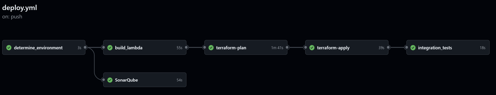

## End-to-End RAG Infrastructure & Backend on AWS

**Terraform-based Infrastructure as Code (IaC)** for deploying complete AWS infrastructure and backend services.  
Estimated cost: ~$3 (~₹250) without the free tier. To avoid extra charges, **use the cleanup script** in the `scripts` folder once you're done.

👉 Related UI: [rag-app-on-aws-ui](https://github.com/genieincodebottle/rag-app-on-aws-ui)  
📺 **YouTube breakdown video coming soon...**



---

### 📚 Table of Contents

- [Overview](#overview)
- [Flow Diagram](#flow-diagram)
- [Infrastructure Components](#infrastructure-components)
- [Repository Structure](#repository-structure)
- [Prerequisites](#prerequisites)
- [Deployment](#deployment)
- [CI/CD Pipeline](#cicd-pipeline)
- [Environment Management](#environment-management)
- [Utilities](#utilities)
- [Uninstallation](#uninstallation)
- [Related UI](#related-ui)
- [Contributing](#contributing)

---

### 🔍 Overview

This repository contains the complete Terraform codebase for provisioning and managing the AWS infrastructure that powers the **RAG (Retrieval-Augmented Generation)** application.

It includes:
- Backend Lambda functions (upload, document processing, query handling)
- Unit and integration tests  
It follows **IaC best practices** for consistent deployments across `dev`, `staging`, and `production`.

---

### 🔁 Flow Diagram

🗺️ [Infra Provisioning Lifecycle Flow](https://github.com/genieincodebottle/rag-app-on-aws/blob/main/images/infra_provisioning_sequence.png)

---

### 🧱 Infrastructure Components

#### 1. **Networking (VPC)**
- Custom VPC (public/private subnets)
- NAT Gateways
- Security Groups
- VPC Endpoints

#### 2. **Compute (Lambda Functions)**
- Document Processor
- Query Processor
- Upload Handler
- DB Initialization
- Authentication Handler

#### 3. **Storage**
- S3 Buckets (Documents)
- DynamoDB (Metadata)
- PostgreSQL RDS with `pgvector`

#### 4. **API & Authentication**
- API Gateway (REST)
- Cognito User Pools
- JWT-based API auth

#### 5. **Monitoring & Alerts**
- CloudWatch Dashboards
- Lambda Logs
- SNS Notifications

---

### 🗂️ Repository Structure

```
.
├── .github/workflows/       # CI/CD via GitHub Actions
├── environments/            # Environment-specific configs (dev, staging, prod)
├── modules/                 # Reusable Terraform modules
├── scripts/                 # Utility shell scripts
└── src/                     # Lambda backend source code
```

🔧 Change `project_name` in `environments/<stage>/terraform.tfvars` to deploy under a custom AWS project name.  
This avoids name conflicts (e.g., with S3 buckets).

---

### 🛠️ Prerequisites

- Terraform `v1.5.7+`
- AWS CLI (configured)
- Python `3.11+` (for Lambda testing)
- GitHub account + repo secrets:
  - `AWS_ACCESS_KEY_ID`
  - `AWS_SECRET_ACCESS_KEY`
  - `SONAR_TOKEN` (optional - for quality gate)

---

### 🚀 Deployment

#### 🔐 Setting Up GitHub Secrets

1. **AWS Keys**
   - Generate from IAM > Users > Security Credentials
   - Add as GitHub secrets:  
     `AWS_ACCESS_KEY_ID`, `AWS_SECRET_ACCESS_KEY`

2. **SonarQube (Optional)**
   - Generate from SonarCloud → `SONAR_TOKEN`

3. **Add Secrets**
   - Go to: GitHub → Settings → Secrets → Actions

---

#### 🧑‍💻 Manual Deployment

```bash
cd environments/dev
terraform init
terraform plan -var="reset_db_password=false" -var="bastion_allowed_cidr=['0.0.0.0/0']"
terraform apply -var="reset_db_password=false" -var="bastion_allowed_cidr=['0.0.0.0/0']"
```

Retrieve outputs:
```bash
terraform output api_endpoint
terraform output cognito_app_client_id
```

---

#### 🤖 Automated Deployment via GitHub Actions

Push to trigger CI/CD:

- **Dev**: `git push origin develop`  
- **Staging/Prod**: `git push origin main`

Manually trigger from GitHub:
- Actions → "Terraform AWS Deployment" → Run

---

### 🔄 CI/CD Pipeline Highlights

1. Detects target environment  
2. Runs SonarQube (if token present)  
3. Builds and packages Lambdas  
4. Executes Terraform plan & apply  
5. Triggers DB init Lambda  
6. Runs integration tests

---

### 🌍 Environment Management

Supports:

- `dev` – development/testing
- `staging` – pre-production
- `prod` – live environment

Configs live under `environments/`.

---

### 🧰 Utilities

`/scripts/` folder includes:

- `cleanup.sh` – tear down all AWS resources
- `import_resources.sh` – import existing AWS infra into state
- `network-diagnostics.sh` – troubleshoot VPC/networking

---

### 🧹 Uninstallation

To clean up resources:

```bash
cd scripts
chmod +x cleanup.sh
./cleanup.sh
```

---

### 🌐 Related UI

- [rag-app-on-aws-ui](https://github.com/genieincodebottle/rag-app-on-aws-ui) – Streamlit frontend powered by this infra

---

### 🤝 Contributing

1. Fork the repository
2. Create a feature branch (`git checkout -b feature/amazing-feature`)
3. Commit your changes (`git commit -m 'Add some amazing feature'`)
4. Push to the branch (`git push origin feature/amazing-feature`)
5. Open a Pull Request

---

> **Note**: This infra may incur AWS charges. Always review `terraform plan` output.  
> Never commit secrets—use GitHub Secrets for security.