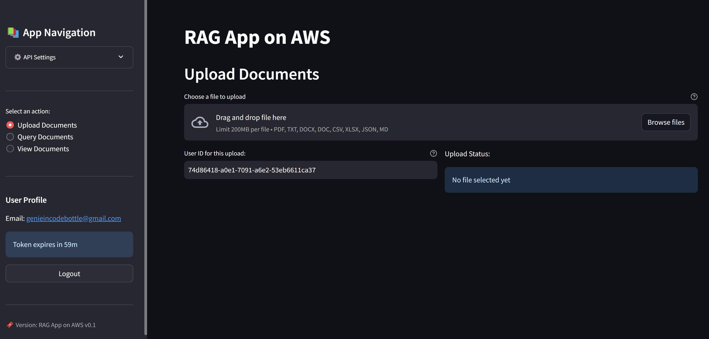

## Hybrid RAG Chatbot: Local UI with Cloud Backend (AWS) 

A Streamlit-based web app for Retrieval-Augmented Generation (RAG) powered by AWS services.




### 🧩 Overview

A web interface to upload documents, query them using natural language, and retrieve AI-generated responses via an AWS-powered RAG backend using Google's free-tier Gemini Pro and Embedding models.

### ✨ Features

- Secure Cognito-based user authentication with auto token refresh
- Upload, view, and manage various document types
- AI-powered querying with relevance scoring and history
- Clean, intuitive Streamlit UI

### 🔁 Application Flow Diagrams

- [Authentication Flow](./images/auth_sequence.png)
- [Doc Upload Flow](./images/document_upload_sequence.png)
- [Doc Processing Flow](./images/doc_processing_sequence.png)
- [Query Processing Flow](./images/query_processing_sequence.png)

### 🏗️ System Architecture

- **Frontend**: Streamlit UI
- **Backend**: AWS API Gateway, Lambda, Cognito, S3, RDS/OpenSearch, Bedrock (or similar)

### ⚙️ Prerequisites

- Python 3.8+
- Streamlit 1.45.0+
- AWS account with backend APIs deployed

### 🚀 Installation

```bash
git clone https://github.com/genieincodebottle/rag-app-on-aws.git
cd rag-app-on-aws/rag_ui
python -m venv venv
source venv/bin/activate  # Windows: venv\Scripts\activate
pip install -r requirements.txt
```

### 🛠️ Configuration

Create a `.env` file:

```env
API_BASE_URL=https://your-api-gateway-url.amazonaws.com/stage
API_KEY=your_api_key_if_needed
DEFAULT_USER_ID=test-user
UPLOAD_ENDPOINT=/upload
QUERY_ENDPOINT=/query
AUTH_ENDPOINT=/auth
COGNITO_CLIENT_ID=your_cognito_client_id
```

### 💡 Usage

```bash
streamlit run app.py
```

Visit `http://localhost:8501`, register or log in, upload documents, and start querying.

### 🔌 API Endpoints

- `/auth`: Register, login, refresh token, password reset
- `/upload`: Upload and track documents
- `/query`: Ask natural language questions, get AI responses

### 🔐 Authentication

Uses Cognito with JWTs, email verification, and password reset.

### 📄 Document Management

Uploaded docs are:
- Converted and chunked
- Embedded into vectors
- Indexed for semantic retrieval

### 🔗 Related Projects

- [RAG Backend & Infra](https://github.com/genieincodebottle/rag-app-on-aws): Terraform infrastructure and backend Lambda codebase.

---

**Note**: Designed for use with [rag-app-on-aws](https://github.com/genieincodebottle/rag-app-on-aws) backend infrastructure.